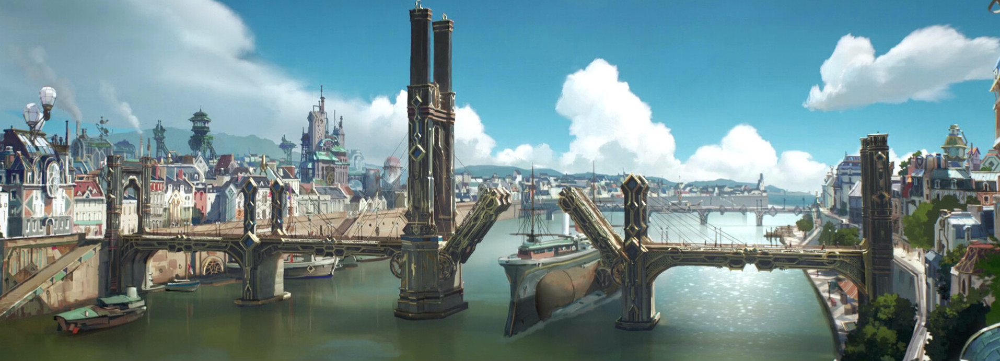
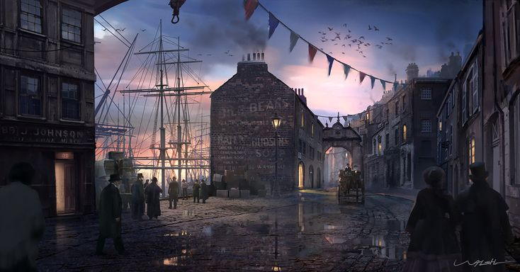
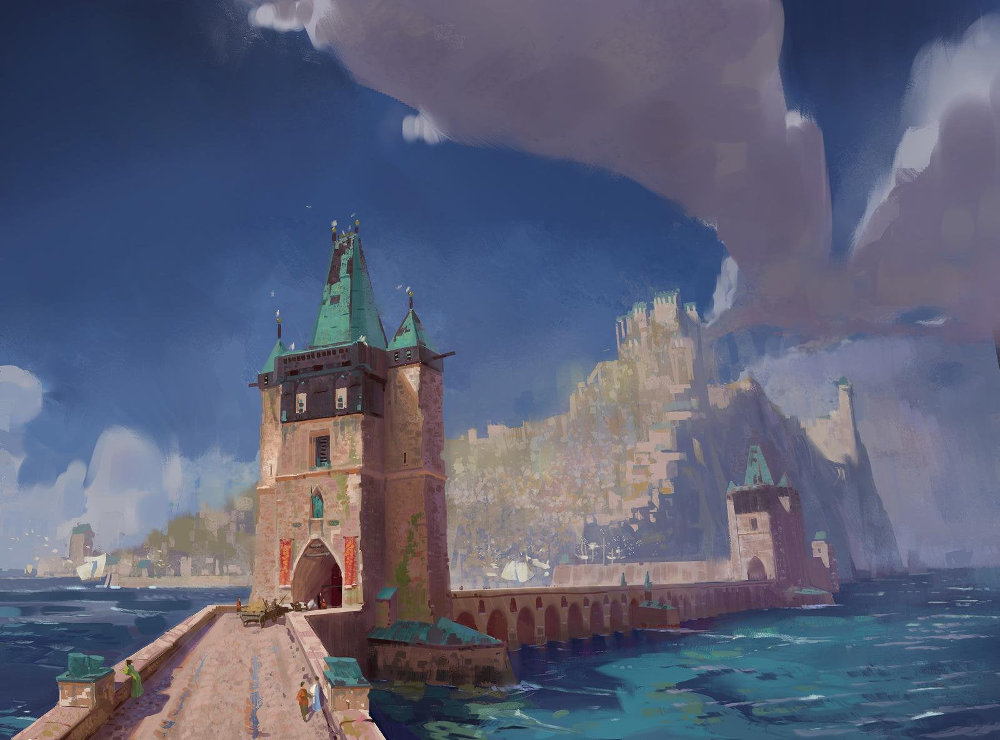
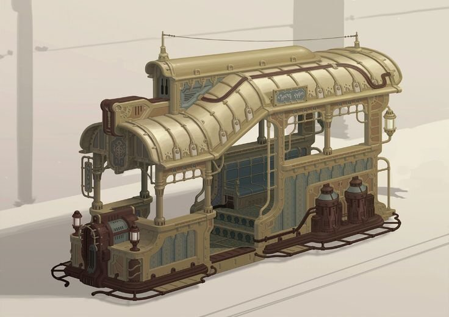
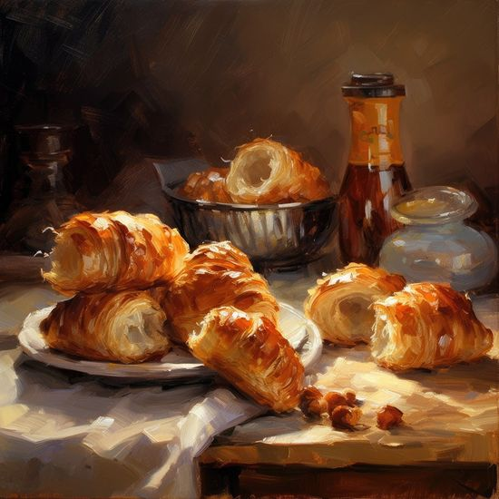

# Old Town
**The city of innovation & opportunity**

---
> [!infobox]
> 
> 
> ## **Old Town**
> 
> 
> 
> ## - Facts -
> |  |  |
> | ---- | ---- |
> | **Classification:**| Metropol |
> | **Nation:** | The Perithien Republic |
> | **Continent:** | Lasion |
> | **Region:** | Ashen |
> | **Population:** | 500 000 |
> | **Founded:** | n/a |
> | **Alliances** | n/a|
> | **Colonies/Subjects:** | Grain Harbour|
> | **Officiell Language:** | Ashen Common|
> | **State Religion:** | Illegal|
> | **Governance:** | Plutocracy  (Republic)|
> | **Leader:** | Senate|
> | **Common Species:**| 70% Humans 11% Dwarfs 7% Haflings 5% Gnomes 7% Other|
> | **Socioeconomical divide:** | 0,25% Aristocracy,  8% Bourgeoisie, 11% Petite Bourgeoisie, 81% Peasantry,|
> | **Climate:** | Temperate zone, Humid, Mild|
>  ## - Other -
> |  |  |
> | ---- | ---- |
> | **Notable People:** | Adrian Skyllefaltsson, Lord Spencer Rothchester|
> | **Districts:** | High Street Ovira East Gard Upper Imari Lower Imari Kib Row|
> | **Points of Interest:** | The Grand Palace The Opera Kalworth Academy The Perithien Senate The Botanical Garden Old Town Skyport 

 A wonderful serenity has taken possession of my entire soul, like these sweet mornings of spring which I enjoy with my whole heart. I am alone, and feel the charm of existence in this spot, which was created for the bliss of souls like mine. I am so happy, my dear friend, so absorbed in the exquisite sense of mere tranquil existence, that I neglect my talents. 
 
 I should be incapable of drawing a single stroke at the present moment; and yet I feel that I never was a greater artist than now. When [Levil](../../1.%20Cities/3.%20Levil) , while the lovely valley teems with vapour around me, and the meridian sun strikes the upper surface of the impenetrable foliage of my trees, and but a few stray gleams steal into the inner sanctuary, I throw myself down among the tall grass by the trickling stream; and, as I lie close to the earth, a thousand unknown plants are noticed by me: 

 When I hear the buzz of the little world among the stalks, and grow familiar with the countless indescribable forms of the insects and flies, then I feel the presence of the Almighty, who formed us in his own image, and the breath of that universal love which bears and sustains us, as it floats around us in an eternity of bliss; and then, my friend, when darkness overspreads my eyes, and heaven and earth seem to dwell in my soul and absorb its power, like the form of a beloved mistress, then I often think with longing, 

 Oh, would I could describe these conceptions, could impress upon paper all that is living so full and warm within me, that it might be the mirror of my soul, as my soul is the mirror of the infinite God! O my friend -- but it is too much for my strength
# History

## Pre-Clash History
Old Town is the oldest city after Tóváros that still exists on Ashen. The city has been called Old Town ever since the Age of Arcana, and today, no one remembers what the city's original name was. 

What is known about the city's early history is that it began as one of the first trading ports established on Ashen by humans. It is assumed that some kind of war then broke out between the elves of Ashen and the humans who had moved there. This war may have involved the gods, but this remains unclear. As more people began moving to Ashen, the city grew and was quickly populated by mages. The city started establishing schools to attract more mages. After 100 years, the city had become one of the largest magical centers in all of Aldiron. The power of the mages grew rapidly, and they decided to lift the city into the air. 

During the time the city flew, Old Town was one of the most powerful cities in the world. 90% of the city's inhabitants were mages in one way or another, and the city's wealth increased significantly. During the militarisation that occurred before The Clash, Old Town was one of the largest producers of magical weapons and golems.

## The Clash  
During the Clash the city played a key role in the war against the gods. As the biggest producer of magical weapons, the city quickly rose up the ranks in the hierarchy of flying cities. It used its position to redirect most of the war away from Ashen in an attempt to save its previous home region. In the end these attempts were fetial, and the war consumed Ashen as well. Old Towns attempts to protect Ashen from the war lead directly to the battle for Ashen which concluded with the destruction of Ashen and the death of the god Sinos. Sinos death was directly caused by Old Town when the cities mages tried to keep the Ashen sub-continent from being destroyed. The amount of arcane power needed was so emends that it ripped Sinos apart which in turn cut destroyed magic as it was known. This was what ultimately ended the war. To keep the sub-continent partially connected the city needed to land between the island which are now known as Menane and Elios. 

## The age of Obliviousness 
After the war, the city's power declined rapidly. Without its magic, many believed there were better places to live. The city's infrastructure was also not designed to function without magic, which made the city difficult to live in. The city shifted its focus to trade, and a large harbor was built around it. This increased the city's importance but not to the same extent as before. 

In the east, another threat grew: a city named Angelfalls, founded by followers of the gods. Angelfalls accused Old Town of causing the gods to no longer wish to have anything to do with their world. Old Town, in turn, clung to its heritage and continued to honor the mages who fought. All but one of the city's old universities and magical schools were abandoned. The only one that remained was Kalworth Academy, over the next 400 years the school continuously tried to figure out what went wrong with magic but with little success.  

## Age of Restoration 
After 450 years of continuous research a small team of mages at Kalworth finally managed to figure out how to use old dwarvish runes to enchant items. This breakthrough led to several others which in turn led to the return of magic to Aldiron. Over the past 150 years, the city's power has returned significantly. Magic has been restored, and the focus on magical objects and automatons has made the city a sought-after destination for anyone wanting to become a mage or artificer. The city is considered one of the most modern in the entire world, which has also attracted nearly 350,000 people to the city in just the past 100 years which has made it into a metropole again.
___
# Economy

## Technology 
Old Town is one of if not the most technically advanced cities in the world. With the use of Orn and dwarvish runes the city had managed to start a small industrial revolution. This revolution has led to cable carts, trams, automatons, skyports, Highrise buildings and small manufactories. The City also has a public fund that heavily invests in research project, artificer workshops and industries.

## Industry 
Small scale manufactories have set up all over Kib Row that produces everything from paper to foodstuff to  brick to furniture. The city is also well known for its glass industry which is still heavily controlled by the guilds and therefore hasn't been industrialised. Minor artificer workshops and labs also produce automatons and arcane engines that are seeing more and more use.  

## Infrastructure 

Old towns roads have been paved since long before the Clash. Much of the infrastructure is from the same period although some bridges and harbours are newer. To the northeast of the city in Upper Imari the Eastern bridge lies. And in the southwest in Lower Imari the Western bridge lies. These bridges were built right after the Clash to connect Old Town to Menane and Elios.

The Cities harbor is in Kib Row. This is one of the biggest harbors in all of Ashen with a capacity of around 1000 ships per year. In the Harbor the city's newest bridge is also located, the Kalworth bridge. 

The Kalworth bridge is the biggest drawbridge in the known world allowing 500-ton ships to pass through it. A smaller harbor can be found in East Gard that allows citizens to take smaller boats out to the city's eastern archipelago.

In the cities northern part of Lower Imari, a fishing harbor can also be found where the cities vast majority of fish comes from. 

The city also has both a cable cart line and a newly built tramline which helps the citizens to traverse the cities high elevations differences. The Tramline goes through Ovaria to High Street, Kalworth academy and East Gard. The Cable cart in turn goes from Lower Imari trough High Street and then to Ovaria and Upper Imari. 

## Imports and Exports 
The city imports a large amount of raw materials in order to supply its industry. Everything from wood to orn to Iron. They also import unprocessed materials like spices, tea leaves, coffee beans and cotton. In return the city exports large quantities of glass, brick, coffee, foodstuff, clothing and furniture. It also exports automatons, trinkets like glasses and pens as well as magical items but at a smaller scale.

# Culture
The perithian culture is strongly connected and influenced by human history in Ashen. Old Towns long history of both being a mageocracy and a formidable trade hub have shaped a culture that puts a large focus on individual freedom, Individualism and meritocracy. The focus on individualism and meritocracy have created a cultural phenomenon where wealthy individuals are seen as entrepreneurial, diligent, creative, innovative and morally good. In contrast poor individuals are seen as lazy, self-destructive and morally bad.

>[!infobox]
>>
>>Pastries and coffee culture have also become very popular in the city with small and large cafés all over the town. These cafés have become the center for cultural exchange and political discussion. This contrasts the more tea-focus cousin of southern Ashen largely influenced by the Chenidien Elves in Tóváros, Opal and Zéstráta
## Cuisine

Old Town cuisine is large comprised of seafood similar to other Ashen cultures. The biggest difference is a larger focus on lobsters, shrimps, clams and crayfish which is a result of the colder water in the northern part of Ashen.

Old Town wealth has also resulted in the availability of restaurants, professional chefs and bakers to develop their craft on a grander scale then other places in Aldiron. This phenomenon has resulted in a more complex cuisine that puts a bigger focus on individual plates and dishes and puts less emphasis on soups, stews and shared meals.  

## Fashion
 
Old Towns fashion scene has quickly become a thing of envy in the last 50 years. With the influx of wealth into the city more and more people sought out ways to show their new wealth. This led to the creation of fashion houses where some of the worlds if not the worlds most experienced and skilled seamstress have developed new and bold fashion trends. For men’s fashion this has resulted in everything from frock coats, single- and double-breasted vests, full-length trousers with fall-front closure and cloaks. 

For women the fashionable silhouette in Old Town has become that of a confident woman, with full low chest and curvy hips. The “health corset" has started to removed pressure from the abdomen and created an S-curve silhouette. Skirts now brush the floor, often with a “train”, even for day dresses. Dresses with full breast, low neckline are also become more and more fashionable in the summer months. But the most important part of a woman's outfit (in particular evening wear) in Old Town is her hat. Huge, broad-brimmed, trimmed with masses of feathers and occasionally complete stuffed birds (hummingbirds for those who could afford them), or decorated with ribbons and artificial flowers.  

Commonfolk in Old Town that do not have the means to invest in the newest fashion trends still usually try to dress rather nicely. Working-class men usually where a (as white as possible) button up shirt, suspenders and working trousers, while working-class women usually wear long skirts with a blouse. 

Hair style is also an important part of the fashion scene in Old Town with woman having masses of wavy hair were fashionable, swept up to the top of the head (if necessary, over horsehair pads called "rats") and gathered into a knot. While most men have nicely kept mustaches (often handlebar, horseshoe or chevron moustaches, sometimes with a soul patch) or beards (often friendly mutton chops, Garibaldi beards or Verdi beards). Their hair is often well-kept but not always styled. Most commonly men with shorter hair were a slicked-back hairstyle while men with longer hair (never below the face) where curtain bangs or some kind of side parted hair.

## Architecture
The architecture of Old Town is influenced by the cities deep and old history. Between the years 538-559 P.B. the city underwent a big renovation lead by the architect Georges-Eugène Kaplan. This renovation removed large parts of the city's then old and detreating infrastructure and replaced it with new and modern housing and city planning styles. This means that a lot of the city was torn down for new houses, Boulevards and parks. The districts most influenced by the renovation was Oviria, Upper Imari and Lower Imari. Kaplan took big inspiration from the grand designs of High Street where styles like neoclassical, Beaux-Arts, Revivalism, Victorian, Baroque Revival and Second Empire style was popular. Kaplan also introduced the concept of on street shops, cafes and restaurants with big windows on the first floor which allowed people to “window shop” for the first time. East Gard was also renovated from a mostly forested area to the park we see today with its big botanical garden, thermal bath and paved walkways. 

Some buildings still follow the more traditional parithian architectural style from the age of arcana, most notably large parts of Kalworth Academy and the Perithian Senate. This style is noted for its large imposing structures similar to that of brutalist or neoclassical architecture but with detailed exteriors and textures more in line with gothic architecture.  

In Kib Row and some parts of Lower Imari the architecture is still heavy influenced by perithian post-clash architecture which is recognized by its simplicity and practicality. After the Clash large parts of the city's infrastructure was unusable as a result of the lack of magic, this led to a more pragmatic mindset when it came to architecture. Houses were built out of cheap brick and covered by plaster. The ground floor is usually used for practical applications like storage rooms, stables or sometimes small “hole in the wall” shops or workshops, while the second and third floors are used as apartments. These houses have little to no running water or sewage system, so most people still use outhouses and wells on small courtyards.

# Politics
Old Town is the capital of the Perithien Republic and is therefore controlled by the Perithien Senat.  Because the republic is a plutocratic wealth plays a big part in both daily and national politics. Political donations, charitable fonds and business deals are all leveraged to win political and economic power in the city. A lot of business owners usually also own charitable foundations that build and maintain housing for their workers to make their company more economically intertwined with the city’s overall economy and in turn make the business critical for the survival of the overall economy. Although bribes are illegal it’s wildly speculated that the cities political class runs on them. 

Political social gatherings are also commonplace in Old Town. This could be balls, banquets or meetings in coffee houses. These gatherings are where the real political deals are made, it’s also in these types of gatherings that new political ideas are being created. These new ideas have most recently been focused on emancipation. The lower classes and parts of the petite bourgeoisie have long felt that they are being sidelined in order to increase profits and consolidate aristocratic power.  

The day-to-day operation of the city is controlled and managed by The Old Town City Council. The council is responsible for approving or denying business or construction permissions, manage services like the Old Town Police department and the Old Town Fire brigade, lastly, they are also responsible for the construction and maintenance of the city's local infrastructure like roads, the new tramline and the maintenance of East Gard.

## International relationships
Old Town has over the last century slowly started to isolate itself from the other Ashen powers. This isolation is a result of Old Towns grand expansions all over Ashen. Today Old Town controls around 18% of Ashens total landmass (was at 25% before the liberation of Géant) which is the biggest single share of controlled land by any Ashen powers (in compressing the two second biggest powers The Osolarian Empire and Angel Falls each control around 10% of Ashens landmass). This expansion has made the other powers in Ashen anxious which has led to them not wanting to fully align with Old Town. This has not hindered trade between the different powers since 97% of all trade in the region is handled by privately owned trading companies like Thornes & Sons, Dawnphare Merchant Consortium and Starling & Johnson's. The only real trade that Old Town manages themself are orn imports from Oasis. This has made Old Towns relation to Oasis an important and controversial political discutient over the last years. The two nations are big trading partners but at the same time compete for the power of Ashen. In later years Oasis has started to get ahead when it comes to magic proficiency and standards of living, but Old Town still controls much more land than Oasis and have a much bigger military.  

Old Towns rivalry with Angel Falls is also at it’s all time high with drums of war drifting on the wind. Large Old Town navy patrols have been seen around Ashen and reports of military movements over Elios have also been reported. The escalation stems from the sinking of an Old Town passenger ship which was quickly blamed on Angel Falls.

# Climate
Old Town like most of northern Ashen is colder than the southern part of Ashen. Even though Old Town is located longitudinal in the middle of Ashen the cold water and winds from the northern parts of the Unkown Sea makes the climate more on par with southwestern Lasion. Under Suncrest the temperature is around 17°C-22°C with some mild rainy days. Though sometimes heatwaves do hit the city where the temperature can rise to around 34°C-35°C. Under Snowdeep the temperature stays around 3°C-10°C. In some instances, the temperature goes below freezing (around 3-6 days a year) with a recorded low temperature of -15°C under the great frost of the year 2 P.B. Under Snowdeep, Harvestdawn and Bloomrise rain is common with an average of around 100 rain days per year. Snow generally is seen at least for one day per year but usually gets washed away fast.

# Districts
## High Street 
High Street is the most opulent district in Old Town, it’s here that the upper echelons of society live. Grand boulevards, squares and parks gives the area a spacious feeling. The sidewalks are
wide with large areas for sidewalk seating and rows of trees. 

Most people who live in High Street lives in large apartments usually around 200m2 with around 7 rooms, but some live in grand townhouse almost as big as palaces with gardens, ballrooms and several guestrooms. These townhouses are located in the eastern part of the district overlooking East Gard Bay and the Botanical Gardens. 

Some notable buildings in High Street are the Grand Palace a massive building where banquets and balls are held and the Perithien Opera, the largest opera house in the world seating almost 4000 people.

## Ovira 
Ovira is where the Perithien Republics power sits. Almost all government buildings are located in the district as well as the headquarters of the Citadel Bank and Kalworth Acadamy.

Because of this a lot of the total area is occupied by non-housing buildings making this district the least populated after East Gard. The boulevards and squares of High Street has nothing on Ovira. Walking on the street here feels like walking on the main squares of other cities. Of course, some parts of the district are allocated to housing and these areas have more narrow streets although still big compared to other parts of the city. The Big boulevards often lead up to a square where several of these government agencies, banks or other important infrastructure is located.

Oviras only housing option is apartments. Usually, they are quite spacious with an area of around 100m2 and 3-5 rooms although some apartments are smaller being around 30m2 having 2-3 rooms. 

Some notable buildings in Ovira include the Perithien Senate and large parts of Kalworth Acadamy.  

## East Gard 
East Gard (also called the Garden) is the national park of the Perithien Republic. Spanning around 20% of the cities total area this park is filled with statues, fountains, greenery and walking paths.

The northern parts of the district are more urbanized with a harbor, a botanical garden and zoo as well as parts of Kalworth Acadamy.The Southern part is almost entirely greenery as well as a river and a lake. Under Snowdeep the lake is artificially frozen which allows people to skate on it. 

Outside of East Gard a small archipelago lays where people frequently go to on daytrips. The biggest island East Point also has some houses that people either rent or own and then go to during Suncrest. 

## Upper Imari 
Upper Immari stretches from the most eastern part of the city under Highstreet to about the middle of the city. The district is mostly made up of apartment housing and shops, some cafes, pubs and restaurants can also be found all over the district. The streets are smaller than both Ovira and Highstreets but still fits one carriage and a horse. The sidewalks are usually lined with outside seating areas for restaurants and cafes or with products sold by stores.

Upper Immari was the district most influenced by the Kaplan Renovation of 538-559 P.B. It’s here we can see Kaplans famous apartment buildings. Usually, 5-7 stories tall with the first floor being decorated to commercial purposes often with large windows and entrances, after that comes a mezzanine used for storage or housing for shopkeepers.

The second floor features high ceilings, large windows and often balconies. This floor is seen as the most prestigious floor and is typically reserved for wealthier residents. The third and fourth floors have slightly lower ceilings and windows but still have balconies. The fifth and sixth floors have lower ceilings with smaller and fewer rooms. These apartments are usually occupied by less wealthy individuals that still want to live close to the halls of power in High Street and Ovira. Lastly is the attic used for storage or servants’ quarters. 

Notable places in Upper Imari are the Old Town Skyport that is being built and The Diplomat, a restaurant and bar where political discutients are commonplace. Seen by many as the center for political discutients by the lower classes in Old Town.

 

## Lower Imari 
Lower Imari is the most populated district in Old Town. Large parts of the district are still not renovated from before the clash which have made the living standard here relatively tough. The Eastern parts of the district are newer with a similar aesthetic to Upper Imari.

While the eastern and especially southeastern parts are relatively rough. Most houses have around 3 floors with some kind of storage on the first floor with apartments on the second and third floors.Streets are quite narrow and are usually filled with different stalls that sell everything from food to flowers to clothing. Taverns and bars also fill the streets with lively music and life thorough the night with the most northern parts of the district close to the northern harbor being seen as a bordello district where brothels and pubs are common. 

## Kib Row 

Kib Row is today mostly made up of storage houses, workshops and small manufactories. The People living here are from the poorest groups of society. The district’s buildings are old and need repairs but are still crampet with families. Large parts of the area are taken up by the harbor and by fishing docks where most of the cities fish comes from. This makes most parts of the area smell of saltwater and fish.

In the eastern part of the district artificer workshops and a large number of the city’s manufactories can be found. The parts where people do live are often nicer than in the industrial areas but without a sewage system the smell of fish turns to a smell of excrement.Large parts of the residential areas are located on the islands near the harbor, here people take gundalows to travers from one island to the next. Small canals are also built into the districts which has made the transport of goods and people easier.These canals are also used to transport sick sailors to special quarantine houses where they are taken care of. Though these houses are becoming old, so illnesses usually escape into the normal population which has in recent year become a big problem in the city.

___
---
---