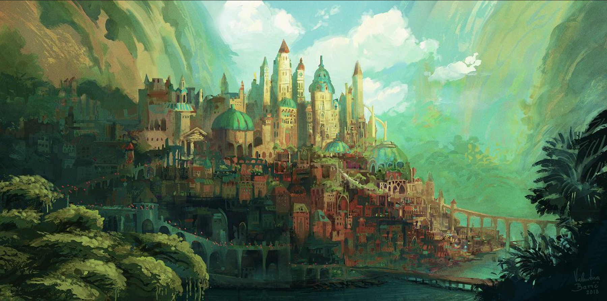

# The World of Aldiron

> [!quote] 
<i>After the great clash, few humans remained and even fewer remained with their humanity - unknown elf circa 120</i>

> 

<iframe src="https://blizzardjr.github.io/ashen-test/" width="100%" height="800px"></iframe>

## 
 Table of Contents: 

> [!column| no-t no-i]
> 
>
>> [!bug| no-i ttl-c]- Cities
>>
>> - [Old Town](1.%20Cities/1.%20Old%20Town.md)
>> - [Oasis](2.%20Residue%20Buildup,%20Veil%20Susceptibility%20&%20Veil%20Scarring.md)
>> - [Levil](1.%20Cities/3.%20Levil.md)
>> - [Al-Mohawia](4.%20The%20Spells.md)
>
>> [!error| no-i ttl-c]- The Races
>>
>> - [Overview](4.%20The%20Races/1.%20Overview/The%20Races%20of%20Vilenought.md)
>> - [The Monkhalyr](4.%20The%20Races/2.%20The%20Monkhalyr/1.%20Lore.md)
>> - [The Markhalyr](4.%20The%20Races/3.%20The%20Markhalyr/1.%20Lore.md)
>> - [The Venthalyr](4.%20The%20Races/4.%20The%20Venthalyr/1.%20Lore.md)
>> - [The Anthalyr](4.%20The%20Races/5.%20The%20Anthalyr/2.%20Mechanics.md)
>> - [The Urashalyr](4.%20The%20Races/6.%20The%20Urashalyr/1.%20Lore.md)
>> - [The Varashalyr](4.%20The%20Races/7.%20The%20Varashalyr/2.%20Mechanics.md)

> [!column| no-t no-i]
>> [!bug| no-i ttl-c]- The Gods
>> - [The Gods & Pantheons](3.%20Gods%20&%20Religion/1.%20Overview/The%20Gods%20&%20Pantheons.md)
>>  
>> - [The One](3.%20Gods%20&%20Religion/2.%20The%20One%20True%20God/1.%20The%20One.md)
>> - [The Trinity](3.%20Gods%20&%20Religion/3.%20The%20Trinity/1.%20The%20Trinity.md)
>>   - [The Creator](3.%20Gods%20&%20Religion/3.%20The%20Trinity/2.%20The%20Creator.md)
>>   - [The Preserver](3.%20Gods%20&%20Religion/3.%20The%20Trinity/3.%20The%20Preserver.md)
>>   - [The Destroyer](3.%20Gods%20&%20Religion/3.%20The%20Trinity/4.%20The%20Destroyer.md)
>> - [The Nine](3.%20Gods%20&%20Religion/4.%20The%20Nine/A_The%20Nine.md)
>>   - [She Who Weeps](3.%20Gods%20&%20Religion/4.%20The%20Nine/B_She%20Who%20Weeps.md)
>>   - [The Silent King](3.%20Gods%20&%20Religion/4.%20The%20Nine/C_The%20Silent%20King.md)
>>   - [The Bound One](3.%20Gods%20&%20Religion/4.%20The%20Nine/D_The%20Bound%20One.md)
>>   - [The Shattered Queen](3.%20Gods%20&%20Religion/4.%20The%20Nine/E_The%20Shattered%20Queen.md)
>>   - [The Warden Of Shadows](3.%20Gods%20&%20Religion/4.%20The%20Nine/F_The%20Warden%20Of%20Shadows.md)
>>   - [The Burning Judge](3.%20Gods%20&%20Religion/4.%20The%20Nine/G_The%20Burning%20Judge.md)
>>   - [The Passionate Duett](3.%20Gods%20&%20Religion/4.%20The%20Nine/H_The%20Passionate%20Duett.md)
>>   - [The Gilded Magnate](3.%20Gods%20&%20Religion/4.%20The%20Nine/I_The%20Gilded%20Magnate.md)
>>   - [J_The Herald of Change](3.%20Gods%20&%20Religion/4.%20The%20Nine/J_The%20Herald%20of%20Change.md)
>> - [Minor Gods & Aspects](3.%20Gods%20&%20Religion/5.%20Minor%20Gods,%20Spirits%20&%20Aspects/1.%20Minor%20Gods%20&%20Aspects.md)
>>   - [The Gracious Reflection](3.%20Gods%20&%20Religion/5.%20Minor%20Gods,%20Spirits%20&%20Aspects/2.%20The%20Gracious%20Reflection.md)
>>   - [The Spiteful Shade](3.%20Gods%20&%20Religion/5.%20Minor%20Gods,%20Spirits%20&%20Aspects/3.%20The%20Spiteful%20Shade.md)
>>   - [The Ashen Sage](3.%20Gods%20&%20Religion/5.%20Minor%20Gods,%20Spirits%20&%20Aspects/4.%20The%20Ashen%20Sage.md)
>>   - [The Primal Sovereign](3.%20Gods%20&%20Religion/5.%20Minor%20Gods,%20Spirits%20&%20Aspects/5.%20The%20Primal%20Sovereign.md)
>
>> [!bug| txt-c ttl-c no-i]- The PC:s
>> - [General Rules & Specifics](9.%20Mechanics/General%20Rules%20&%20Specifics.md)
>> - [Long-Term Fatigue](9.%20Mechanics/Long-Term%20Fatigue.md)
>> - [Mutations](9.%20Mechanics/Mutations.md)
>> - [Skills](9.%20Mechanics/Skills.md)
>> - [Tables](9.%20Mechanics/Tables.md)
>> - [Traits](9.%20Mechanics/Traits.md)
>> - [Weaving Traits](9.%20Mechanics/Weaving%20Traits.md)

## What has happened so far?

**Recap**
 
One morning, when Gregor Samsa woke from troubled dreams, he found himself transformed in his bed into a horrible vermin. He lay on his armour-like back, and if he lifted his head a little he could see his brown belly, slightly domed and divided by arches into stiff sections. 

The bedding was hardly able to cover it and seemed ready to slide off any moment. His many legs, pitifully thin compared with the size of the rest of him, waved about helplessly as he looked. "What's happened to me?" he thought. 

It wasn't a dream. His room, a proper human room although a little too small, lay peacefully between its four familiar walls. A collection of textile samples lay spread out on the table - Samsa was a travelling salesman - and above it there hung a picture that he had recently cut out of an illustrated magazine and housed in a nice, gilded frame. 

It showed a lady fitted out with a fur hat and fur boa who sat upright, raising a heavy fur muff that covered the whole of her lower arm towards the viewer. Gregor then turned to look out the window at the dull weather.

___

| PC:s     | Status       |
| -------- | ------------ |
| Aster    | Dead         |
| Skurim   | Alive        |
| Gundlar  | In love      |
| Jamal    | Reborn       |
| Eviticus | Stressed     |
| Archable | Studying     |
| Buffert  | On a pilgrim |

___

